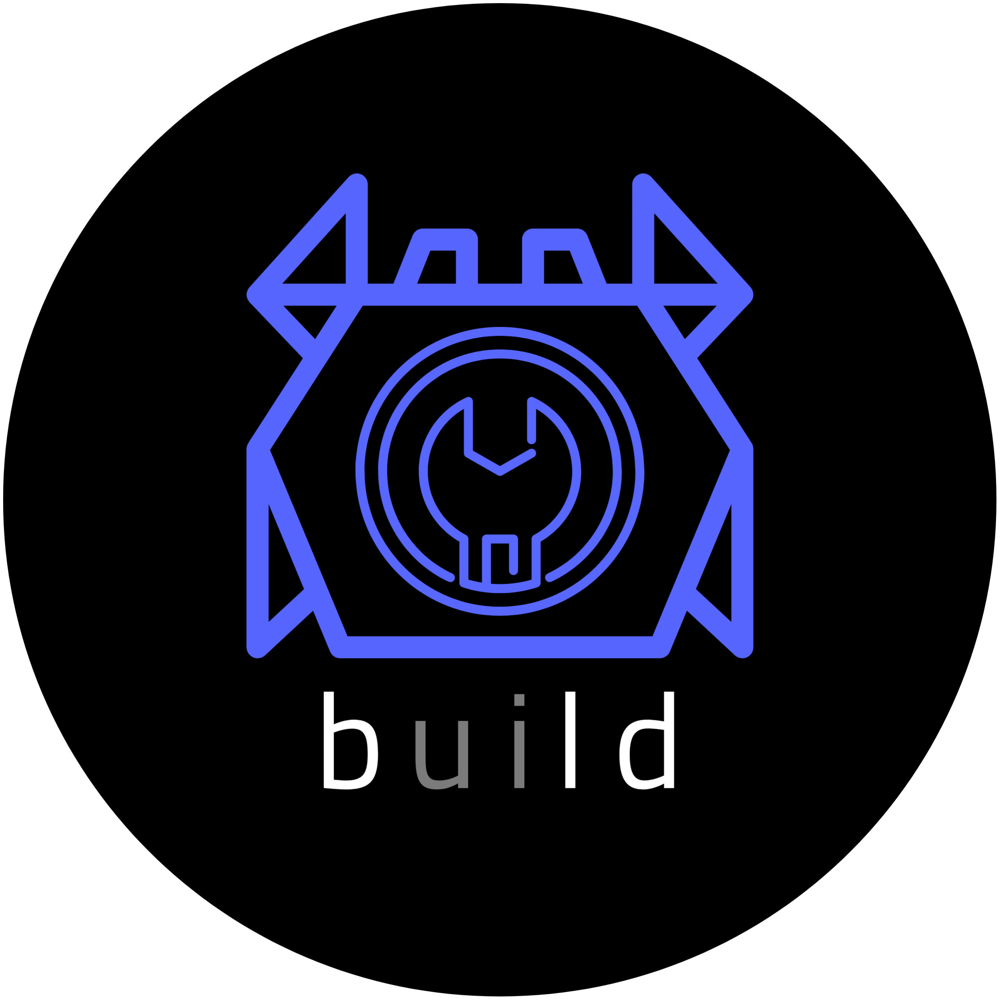

<p align="center">
    
</p>

# What is Bld
Bld is a CI/CD tool that targets to build pipelines both in a local environment and in a server.

A couple of years back when setting up a home lab, I had the problem with all the CI/CD projects being either cloud only or a local deployment required to run a server. So the inception for the tool was to be able to run pipelines locally the same way they would run on a server. Once that was done, a server mode was added in order to dispatch builds on other machines.

# Building
Bld is built using the Rust programming language so you will need a [Rust installation](https://www.rust-lang.org/tools/install) in order to compile it.

### External dependencies
Additionally the project requires some external dependencies:
- build-essential
- pkg-config
- libssl-dev
- libsqlite3-dev
- (optional) docker

> The package names are for Debian based distributions, install the appropriate packages on your distribution of choice.

### Build instructions
Once you have installed all of the above, you can build the project as follows
```bash
$ git clone https://github.com/Kani-Maki-Gang/bld.git
$ cd bld
$ cargo build --release
$ ./target/release/bld --version
```

### Musl builds
Since there are multiple dependencies deployment of bld can be difficult, so the project supports targeting musl for static linking. If you have an existing bld binary locally built/installed then follow the below instructions. This steps require a docker installation.

```bash
$ bld run -p build-musl.yaml
$ ls dist/bld
```
With the above a new container will be built with all the necessary dependencies for building the project and the bld pipeline will clone the repository, build the binary and the copy it in the musl/dist directory.

If a bld binary is not available, you will have to start a container with the bld-musl-builder and do the steps manually.

> The project currently targets only Linux. It has not been tested on Windows or Macos.

# Creating a project
If you have followed the above Building section and have a Bld binary available, you can execute the below commands to initialize a Bld directory.
```bash
$ bld init
```
This will create a `.bld` directory with 2 files
- `config.yaml` Which contains the configuration for the current directory
- `default.yaml` The default pipeline which simply echos a 'hello world'

To test out the default pipeline simply execute
```bash
$ bld run -p default.yaml
```
The pipeline will execute on your machine, but it can be changed to target a docker container. Below is the same default pipeline but having the `runs-on` section changed to target an `ubuntu` docker image, just make sure it is installed.

```yaml
runs_on: ubuntu
version: 2
jobs:
  main:
  - echo 'hello world'
```

# Creating pipelines
In order to make new pipelines, you just need to create a yaml file under the `.bld` directory. For better structure you can add pipelines in directories and give the relative path to bld.

For example given a sample project you might want to have a build and deploy pipelines, the structure could be done as
```
.bld
 |    config.yaml
 |    default.yaml
 └─── sample
      |    build.yaml
      |    deploy.yaml
```
And the pipelines can be run with their relative path inside the `.bld` directory.
```bash
$ bld run -p sample/build.yaml
$ bld run -p sample/deploy.yaml
```

# Graceful shutdown
Since each run could create and run container as well as issue remote runs to bld servers, the cli handles the SIGINT and SIGTERM signals in order to properly cleanup all of the external components. To be noted that the stop command which stops a pipeline running on a server, can be used for a graceful early shutdown of a pipeline.
