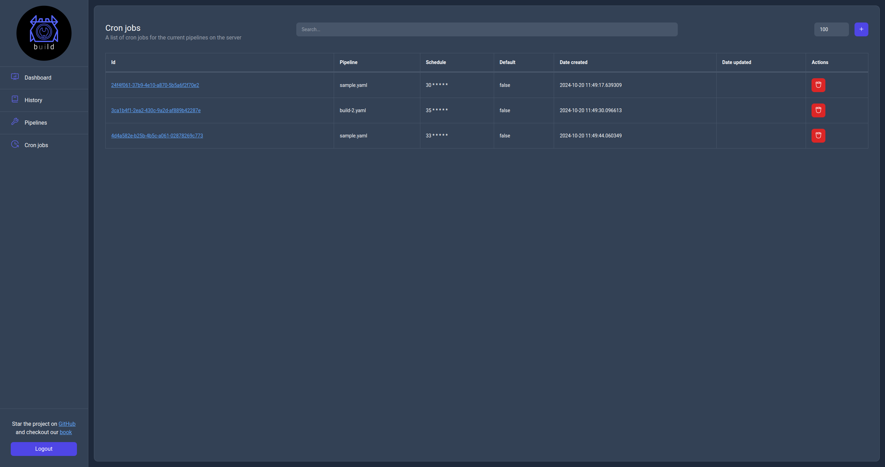

# Cron jobs page

The cron jobs page displays the list of cron jobs available to the server with the ability to search, filter and perform actions on them.

    

The available action on this page are to create a new cron job, delete an existing one or click on the `Id` url to navigate to the cron job information page.
