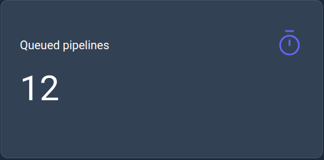
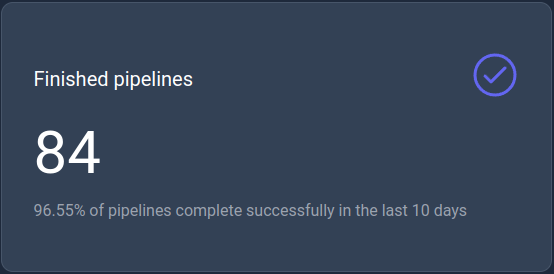
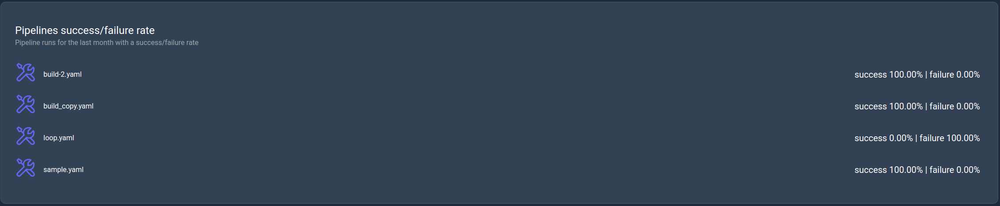

# Dashboard page

The dashboard page (home page) will present to the user KPIs related to pipeline runs with each displaying a specific metrics for a specific time frame.

    

## Queued pipelines

This KPI displays the current number of queued pipelines to run.

    

## Running pipelines

This KPI displays the current number of running pipelines with the maximum capacity of worker configured for the server.

    

## Finished pipelines

This KPI displays the number of successfully finished pipelines in the last _10_ days.

    

## Faulted pipelines

This KPI displays the number of faulted pipelines in the last _10_ days.

    

## Total runs per month

This KPI is a bar chart that displays the total number of runs per month in the current year.

    

## Most runs

This KPI displays the list of users with the most runs in the last month.

    

## Success/Failure rate

This KPI displays the success/failure rate of the pipelines in the last month.

    

