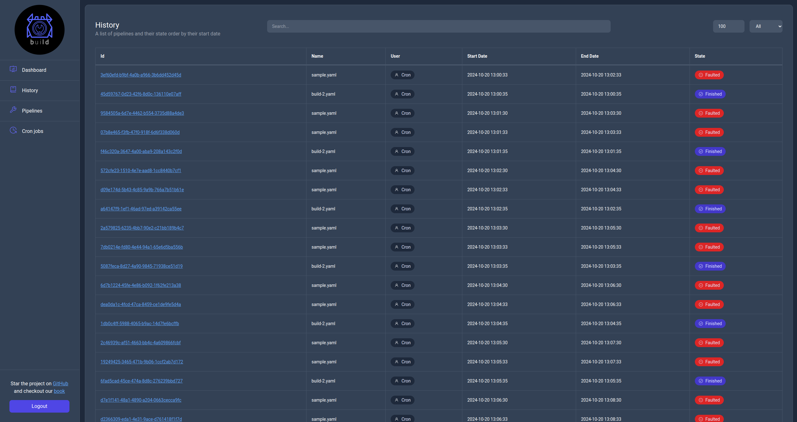

# History page

This page contains information about all pipeline runs on the server with the ability to search and filter them. Additionally by clicking their `Id` url you can see the actual logs for each run.

    

