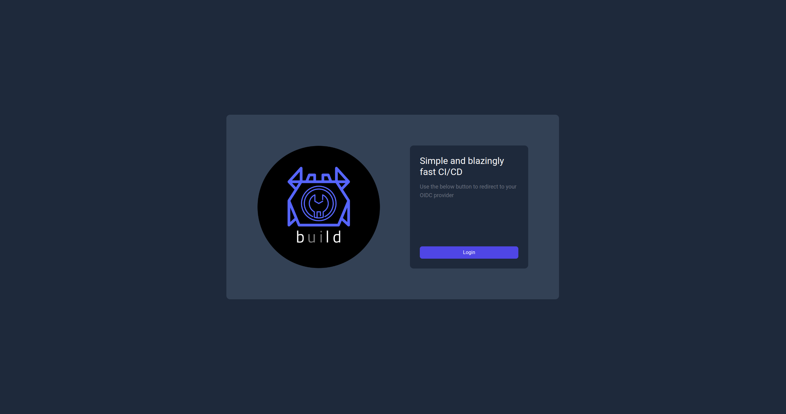

# Login page

When a Bld server has been configured with an authentication method then the first page on should see when navigating to the server is the login page. The login page is a simple form with a redirect button that will initiate the authentication process. The use will be redirected to the configured authentication provider and once they have logged in they will be redirected to the home page of the Bld server UI.

    

