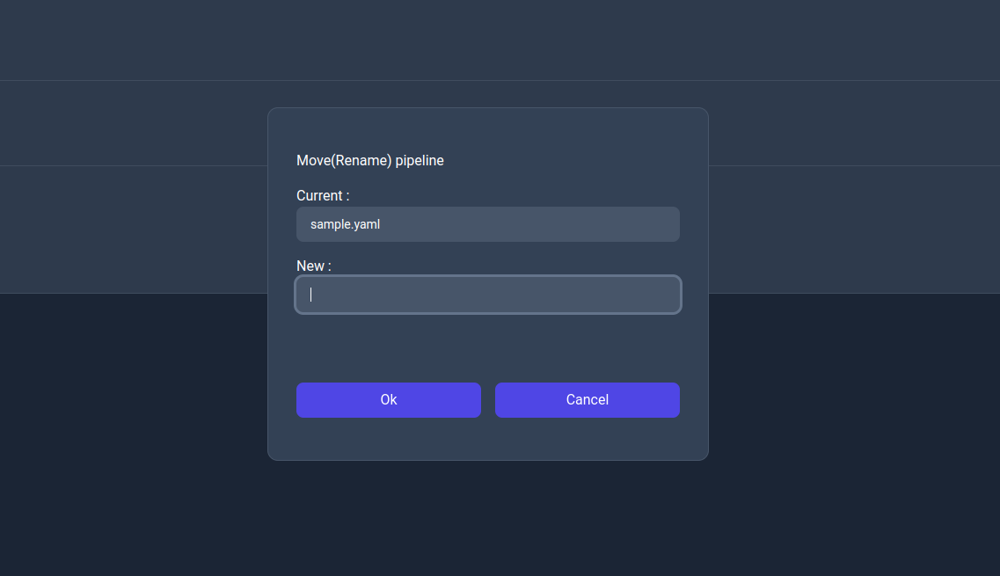
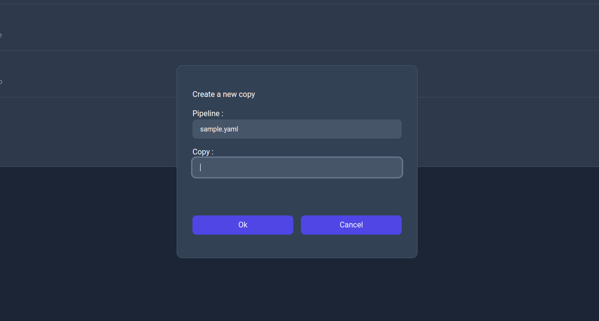
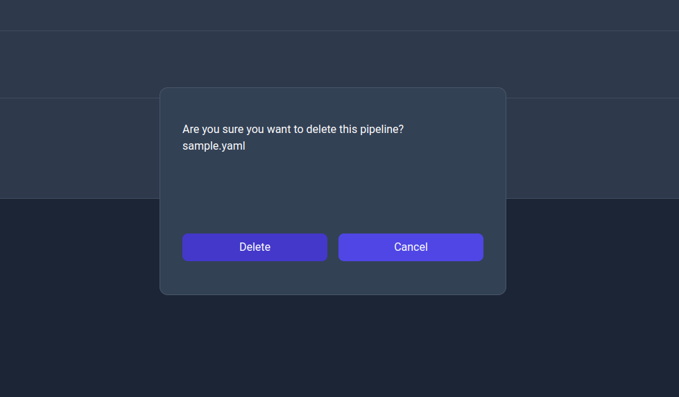

# Pipelines page

The pipelines page displays the list of pipelines available to the server with the ability to search, filter and perform actions on them.

    

For each pipelines the following actions are available:

    

Where each below is listed the action related to each one of them in the same order as they appear in the image above:
- `Edit`: This action allows the user to edit the pipeline by navigating to its info page (as of v0.4 the ability to edit the pipelines isn't implemented so you can only inspect the information about the pipeline).
- `Run`: This action allows the user to run the pipeline by navigating to the run page.
- `Move (Rename)`: This action allows the user to move the pipelines to a different path essentially renaming it.
- `Copy`: This action allows the user to create a new copy of the pipeline to a different path.
- `Delete`: This action allows the user to delete the pipeline.

Each operation triggers an action but some of them display a dialog to confirm or configure the operation.

### Move (Rename) action dialog

    

### Copy action dialog

    

### Delete action dialog

    

