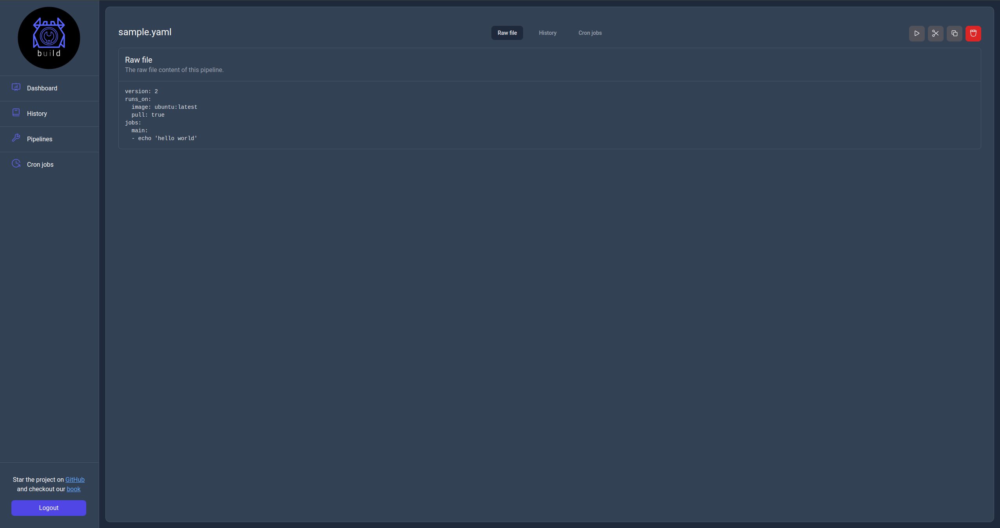

# Pipelines information page

In the info page the user can see the actual pipeline file, runs and crons jobs configured. Additionally most actions available in the `Pipelines` page are also available here.

## Raw file view

    

## History view

    

## Cron jobs view

    

