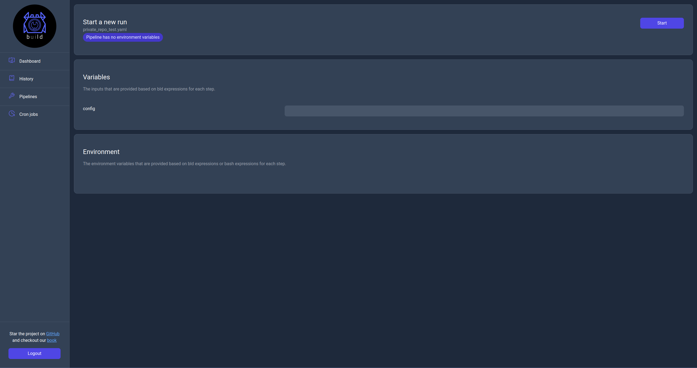

# Run page

When a user click the `Run` action they will be navigated to this page which they can configure the run's variables and then start the pipeline. Once the use clicks start they will be navigated to the `Monitor` page.

    

