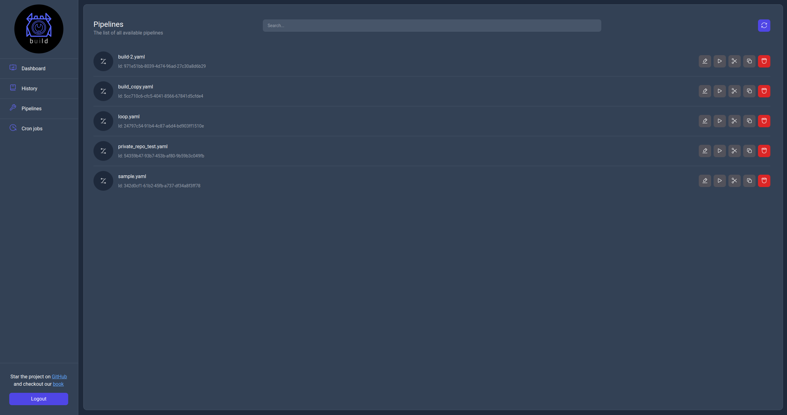

# User interface

A Bld server offer the ability to use a web interface to manage pipelines, see statistics and logs as well as manage reoccuring tasks. Some screenshots of the interface are shown below.

    

    

    

    

